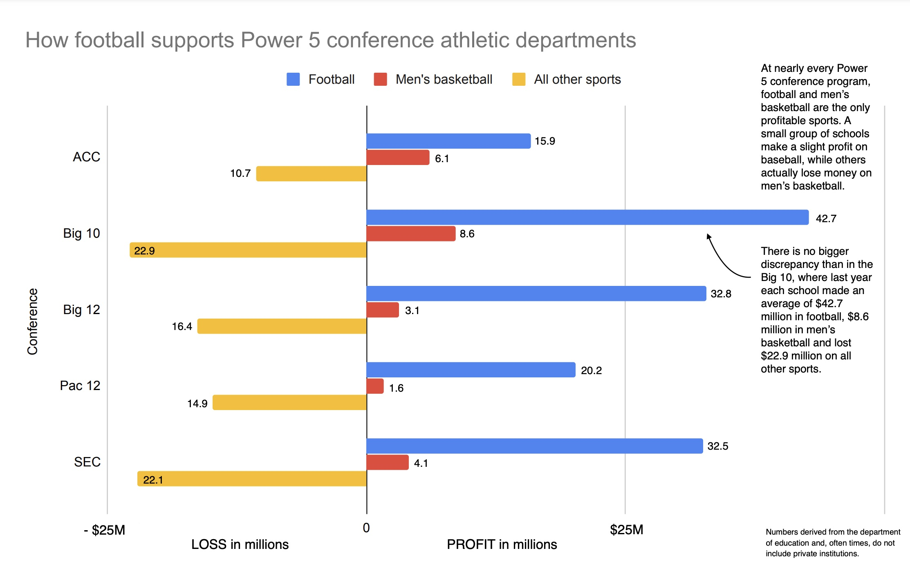

# Assignment: Critique by Design

### Assignment Overview

In this assignment, we are finding a visualization that could be improved and redesign it to make it more effective.

### Part I: Select a Visualization

For this assignment, I chose a visualization from a [Sports Illustrated article](https://www.si.com/college/2020/04/08/college-football-future-2020-ncaa-coronavirus) originally published in April 2020 in the wake of the COVID-19 pandemic. The article explored the potentially far-reaching effects that cancelling the 2020 college football season may have on the world of college-athletics. The visualization itself attempted to show the extent to which Power 5 Conference athletic departments depend on their football programs to finance all other NCAA sports programs.

  

I was initially "attracted" to this visualization because it struck me as ugly and, therefore, immediately recommended itself for improvement. After taking time to inspect it further, I realized that the chart did actually have an interesting story to tell. It was surprising to see the extent to which football carried the other sports programs financially, especially in contrast to men's basketball, which I assumed would be more profitable than it was. The fact that I wasn't able to discover that interesting information until I took the time to really look at the chart indicated there was even more room for improvement. An ugly visualization that also contians useful information is a great candidate for redesign. 

### Part II: Critique the Visualization

Overall, I found that this data visualization contained useful information, but its lack of visual appeal, perceptibility, and engagement hindered it in delivering its message. I liked that the chart focused on the Power 5 Conferences and provided all the information needed to convey the main idea. I also think the intuitive chart format made it easy for the audience to gauge the difference between football as a profitable sport and all other sports. It was smart to group ‘all other sports’ together into one group rather than breaking them out into separate categories, as it allows the viewer to focus on football as the differentiating sport.

I thought this chart left a lot to be desired in terms of its perceptibility, aesthetic appeal, and engagement. It makes its point, but there are certainly aspects of the visualization that were easier to comprehend than others. The fact that the 0 on the x-axis is centered takes a moment to recognize when there are still lines on the far left and far right of the graph. The colors don’t convey anything beyond categorizing the bars and could be used better to advance the message. The bar chart is intuitive, but having three bars going two different directions makes it less clear how they compare to each other relationally. One of the text boxes in the graph could be more effectively used as a subtitle and the other one seems to repeat much of the same information already contained in the chart. If calling out the Big 10 conference advances the overall message, which it may not, doing so visually instead of using text would be a better approach. The small disclaimer in the bottom right hand corner about the source data not including private institution calls into question the truthfulness of the chart without much explanation as to how that should impact the audience’s interpretation. Finally, the visualization is not very engaging; there isn’t much about it that recommends itself to an audience or makes an effort to draw them in. 

I also thought this chart failed to leverage its content to fully engage its likely audience. The original article was a Sports Illustrated piece, so the audience was primarily sports fans/enthusiasts/analysts. I don’t think this visualization was terribly effective for reaching that audience because it resembles a chart you would find in an academic report more than a graphic you might see displayed on ESPN or featured on a network pregame show. Sports are part of the entertainment industry and, as such, audiences are accustomed to seeing aesthetically pleasing conference logos and the polished branding of university sports teams when they engage with that content. This visual doesn’t create the same amount of interest or provide those familiar visual elements that serve as immediate cues of the audience. Seeing a favorite conference or sports team logo can also evoke emotion in viewers, and this visualization misses some opportunities to leverage that emotion to create interest.

In terms of what I would do differently, I would start by making a more declarative title like “Football is the Life Support for all Other Power 5 Conference Sports” or similarly attention grabbing to draw the reader in. I would make the text box in the upper left a subtitle to the title and would delete the other callout box altogether. I would adjust the color scheme, not using red for men’s basketball (in terms of profit and loss, it’s intuitive to associate ‘green’ with profitable and ‘red’ with loss). I would consider using conference logos instead of text on the y-axis, which would be very familiar to a collegiate sports audience and would resonate more deeply. I would also make the labels on the x-axis more clear, maybe highlighting “PROFIT” and “LOSS” using green and red to emphasize the fact that one is taking away from the other. Finally, I would add a data citation to the graphic and include in the disclaimer the extent of the impact that excluding private schools has on the overall takeaway. If I had a lot of time available, I would experiment with different chart types to see if there’s a clearer way to make the comparison between football and other revenue losing sports. I would also experiment with the option of removing men’s basketball as it’s own separate bar and lumping it in with "all other sports." Although it’s nice to see the degree to which the only other profitable sport lags behind football, it still may not be essential to the message we want to convey.

### Part III: Sketch a Solution

I generated three separate wireframes that I hoped would test out some of the improvemets I came up with during the critique phase. 

### Option 1: Column Stacked Bar Chart ("Tornado" Chart)

In this option, I explored a simpler, more streamlined apporach. I wanted to test my theory that the visualization's underlying message about the importance of football would be just as, if not more, impactful if I removed the reference to men's basketball altogether and instead lumped those numbers in wiith 'all other sports,' which combined still amounted to large losses. 

<a href="https://infogram.com/ab18469d-d893-4cc8-a778-45f34bbc2e2e" style="color:#989898!important;text-decoration:none!important;" target="_blank">Column Stacked Chart</a> <a href="https://infogram.com" style="color:#989898!important;text-decoration:none!important;" target="_blank" rel="nofollow">Infogram</a>

### Option 2: Waterfall Chart

I used this waterfall chart to test how this visualization would do in a 'part to whole' diagram. After all, what this is really showing is how athletic departments' net profitability breaks down into its component elements. This visualization provides slightly more information, although it is less intuitive than a bar chart for most audiences.

<a href="https://infogram.com/f6a9c514-8310-47a8-b44c-8c38b4f7eb5f" style="color:#989898!important;text-decoration:none!important;" target="_blank">Waterfall Wireframe</a> <a href="https://infogram.com" style="color:#989898!important;text-decoration:none!important;" target="_blank" rel="nofollow">Infogram</a>

### Option 3: Stacked Area Chart

I was attracted to the stacked area chart because I saw it as a good avenue to include the men's basketball data in a way that was not distracting. It also allowed me to re-orient the data so that profits/losses are shown on the y axis instead of the x axis, which I find to be more intuitive.

<a href="https://infogram.com/3f6b3430-9917-448c-9b45-f06b8bfdc92e" style="color:#989898!important;text-decoration:none!important;" target="_blank">Stacked Area Wireframe</a> <a href="https://infogram.com" style="color:#989898!important;text-decoration:none!important;" target="_blank" rel="nofollow">Infogram</a>

### Part IV: Test the Solution

I showed my three wireframe diagrams to two separate people and asked them several questions to get their feedback. Their responses are summarized below.

**Adult - Early 60s:**

***All three of these graphs are different visual takes on the same message - can you tell me what the message is?***

Yes, college football makes far more money than any other college sport. Football and Men’s Basketball are the only NCAA sports that make any profit, and they fund the rest of the sports, but even then they bring in millions of dollars for athletic departments.

***What do you find effective or ineffective about each of these graph?  Is there one that you like the best?***

I like that the first one is simple and easy to understand. I like that the conferences are ranked and that the logos are next to the conference names. For the first one I also liked that the numbers are next to the bar charts, but I don’t like that it doesn’t include Men’s Basketball. I think that’s important information

For the second one, I like the color scheme, that the numbers are clear, and that it includes Men’s Basketball. I find the waterfall confusing though and I didn’t understand right away that you have to click through each conference to see their information. I also don’t like that there isn’t a side-by-side comparison.

The third one is my favorite, I like that it shows the step down for each conference from biggest to smallest. It shows how Men’s Basketball profits compare to football, which I think is really useful. I also really like the color scheme, I think it makes it very easy to see what categories are varying degrees of profitable and which one is losses. My one problem with this one is that it doesn’t show the number labels for each bar. 

***Is there anything that you found confusing or surprising?***

I’m very surprised at how little profit Men’s Basketball makes compared to football. I wasn’t surprised to read that football and basketball were the only profitable sports, but I had no idea how much better football performed and that basketball was only barely profitable. Also the sheer scale of the profits from football, even with all those losses, surprised me. 

***Is there anything you would change or do differently?***

No, I really liked the first and third ones, but I liked the third one the best because it included Men’s Basketball.

**Adult - Early 30s:**

***All three of these graphs are different visual takes on the same message - can you tell me what the message is?***

Yes, football is the most profitable sport in college athletics by a long shot. The big 10 is the best of all the conferences in terms of football and Men’s Basketball profits. 

***What do you find effective or ineffective about each of these graph?  Is there one that you like the best?***

I really like the second one because it has all the data that I need, but the third one is probably the best in that it’s the easiest to understand. I like seeing the net profit for each conference, which the second one provides makes super clear, and I like that you can look at the details for each conference. It’s not ideal that you can’t compare conferences side-by-side in the second one though. The thing I don’t like about the first one is that it doesn’t include Men’s Basketball, which I think is really important to include so I want to see that information. Otherwise, the first graph is really visually appealing. Overall, I’d say the third one is the best in terms of the information it provides, the visual appeal, and how easy it is to understand.

***Is there anything that you found confusing or surprising?***

I was surprised that the Big 10 Conference makes the most profit and just overall that Men’s Basketball doesn’t do much more than breakeven. I thought Men’s Basketball brought in more money than that for the athletic departments.

***Is there anything you would change or do differently?***

Overall I think they’re really good, I just wish there was a way you could do side-by-side conference comparison with the waterfall chart or include Men’s Basketball in the first one.

**Takeaways From Feedback:**

I did get some interesting feedback that I found helpful in determining the most important components that should be included in the final visualization. The following were some of the primary takeaways:

1. The Men’s Basketball statistic is important to viewers - they think that it drives home how dramatic the profits from football are. 
2. Having the conference logos in the graphic and ordering the conferences themselves made the message resonate much more strongly.
3. The stacked area chart was rated the best one by both people I talked to, which was interesting because one almost preferred the tornado chart and the other almost preferred the waterfall chart, which are very different visualizations. 
    
 The fact that two people who were initially drawn to initial first visualizations were able to settle on the third one as the best and most interpretable helps me establish that the stacked area chart may appeal to the widest audience. I also got a lot of positive feedback about the aesthetic appeal of the color scheme, as green is reticent of both profits and football turf fields. I initially had questions as to whether or not including profits from Men’s Basketball was essential to advancing the message, but both people I interviewed seemed to think it was really important information once they saw it.

### Part V

### [Back to Homepage](/README.md)